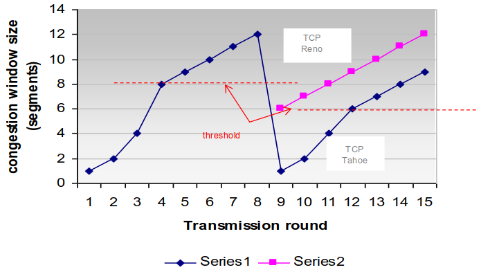

# Capitulo 1 - Nível de Transporte

Os serviços e protocolos de transporte são responsaveis por estabelecer uma conexão lógica entre aplicações executadas em sistemas terminais diferentes. Esses protocolos são executados nos sistemas terminais, onde o emissor divide a mensagem gerada pela aplicação em segmentos, que são transmitidos á camada de rede. No lado do receptor, os diferentes segmentos são reunidos para formar a mensagem original, que é então entregue à aplicação correspondente. Na Internet, dois dos principais protocolos de transporte são o TCP (Transmission Control Protocol) e o UDP (User Datagram Protocol). O TCP oferece uma comunicação confiável e orientada à conexão, enquanto o UDP proporciona uma comunicação mais rápida, porém menos confiável e sem a necessidade de estabelecer uma conexão prévia.

## Multiplexação e Demultiplexação

 - Desmultiplexagem é efetuada pelo sistema terminal destino ao receber um datagrama IP.
 - Cada datagrama contem um segemento TCP ou UDP.
 - Cada segmento possui a identificação da porta de origem e da porta destino.
 - O sistema terminal usa os endereços IP e os numeros de porta para encaminhar o segmento para o socket correto.

## Protocolo UDP - User Datagram Protocol

Funções do UDP:
 - Protocolo de transporte fim-a-fim não confiável;
 - Orientado ao datagrama;
 - Atua como uma interface da aplicação com o IP para multiplexar e desmultiplexar tráfego;
 - Usa o conceito de porta/número de porta;
 - Utilizado em situações que não justificam o TCP, ou quando as aplicações querem controlar o fluxo de dados e gerir erros de transmissão diretamente;

Uma aplicação pode escolher o UDO devido a vários motivos:

 - **Maior controle sobre o envio dos dados:** A aplicação tem autonomia para decidir quando e como enviar ou reenviar dados, sem depender do protocolo de transporte.

 - **Fuga ao controle de congestão do TCP:** UDP não está sujeito às regras rigorosas de controle de congestão do TCP, permitindo à aplicação determinar a taxa de envio de dados.

 - **Controle sobre o tamanho dos dados enviados:** A aplicação decide a quantidade de bytes a enviar em cada transmissão.

 - **Ausência de estabelecimento e terminação de conexão:** Não é necessário criar ou encerrar uma conexão antes da transmissão de dados, acelerando a comunicação.

 - **Ausência de manutenção de informação de estado por conexão:** Não é preciso manter informações de estado por conexão, simplificando o processo.

 - **Menor overhead por pacote:** O cabeçalho UDP é mais leve, com apenas 8 bytes, reduzindo a sobrecarga em comparação com o TCP.

Aplicações escolhem o UDP devido ao maior controle sobre o envio de dados, permitindo à aplicação decidir quando e como enviar ou reenviar dados sem depender do transporte. A fuga ao controle de congestão do TCP e a capacidade de determinar a quantidade de bytes enviados por vez são vantagens. Além disso, a ausência de estabelecimento e terminação de conexão, juntamente com a falta de necessidade de manter informações de estado, resultam em menor overhead por pacote, dado o cabeçalho UDP ser apenas 8 bytes.

## Protocolo TCP - Transmission Control Protocol

Funções do TCP:
 - Protocolo de transporte fim-a-fim confiável;
 - Orientado à conexão;
 - Cada conexão é identificada por um par de sockets;
 - Uma conexao é um circuito virtual entre portas de aplicações;
 - Multiplexa os dados de várias aplicações através de numero de porta;
 - Efetua controlo de erros, controlo de fluxo e controlo de congestão;

### TCP - Datagrama

 - *Porta Orig/Dest* - Nª da porta TCP da aplicação de Origem/Destino;
 - *Numero de Sequência* - Ordem do primeiro octeto de dados no segmento (se SYN -1, este número é o initial sequence number, ISN);
 - *Numero de Ack(32 bits)* - O numero de ordem do octeto seguinte na sequência que a entidade TCP espera receber;
 - *Comprimento Cabeçalho(4 bits)* - Numero de palavras de 32 bits de cabeçãlho;
 - *Flags(6 bits)* - Indicações especificas;
 - *Janela* - Numero de octetos que o receptor é capaz de receber (controlo de fluxo);
 - *Soma de controlo (16bits)* - Soma para a deteção de erros (segm);
 - *Apontador urgente* - Adicionado ao numero de sequencia da o nº de sequencia do ultimo otecto de dados urgentes;
 - *Opções* - Especifica caracteristicas opcionais (ex: MSS, timestamp, factor de escala para a janela, etc.);

### Flags
Flags TCP (1 bit por flag):
 **URG** - indica se o apontador de urgência é válido
 **ACK** - indica se o nº de sequência de confirmação é válido
 **PSH** - o recetor deve passar imediatamente os dados à aplicação (aparece nos seg de transferência de dados)
 **RST** - indica que a conexão TCP vai ser reinicializada
 **SYN** - indica que os números de sequência devem ser sincronizados para se iniciar uma conexão
 **FIN** - indica que o transmissor terminou o envio de dados

### Formulas
*EstimatedRTT*  - (1 - a) * EstimatedRTT + a * SampleRTT   (nomalmente a  - 0.125)
*DevRTT*  - (1 - b) * DevRTT + b * |SampleRTT - EstimatedRTT|   (normalmente b  - 0.25)
*TimeoutInterval*  - EstimatedRTT + 4 * DevRTT

**EstimatedRTT** - media movel de peso exponencial onde a importancia de uma amostra antiga decresce exponencialmente;
**SampleRTT** - medido desde a transmissao de um segmento até a recepção do ACK respetivo;
**Timeout** - quanto maior for a diferença entre os SampleRTT e o EstiimatedRTT, maior será o valor do timeout;

### Gestão de ACK's
|  Evento no Receptor| Ação da entidade TCOA |
|:---:|:---:|
| Chegada de um segmento com o numero de sequencia esperado e tudo tras confirmado | Atrasa envio ACK 500ms para verificar se chega novo segmento.Senão chegar, enviar ACK |
| Chegada de um segmento com o número de sequencia esperado e um segmento por confirmar | Envia imediatamente um ACK cumulativo que confirma os dois segmentos |
|  Chegada de um segmento com o numero de sequencia superior ao esperado. Buraco detectado | Envia imediatamente um ACK duplicado indicando o numero de sequencia esperado |
| Chegada de um segmento segmento que preenche completa ou imcompletamente um buraco | Se o numero do segemento coincidir com o limite inferior do buraco envia ACK imdiatamente. |

Se o emissor receber *três* ACK's duplicados supôe que o segmento respetivo foi perdido e retransmite - o **Fast Retransmit**.

**Fast Recovery** - O Fast Recovery, em conjunto com o Fast Retransmit, é uma prática recomendada, mas não obrigatória, no contexto de transmissão de dados. Ao receber ACK's duplicados, temporariamente amplia-se a janela em 1 MSS por ACK duplicado, permitindo a continuidade di envio sem ajustar a janela. AO receber ACK em falta ou um ACK cumulativo que abranja o ACK em falta, o sistema sai do estado de recuperação rápida. Essa abordagem contribui para a eficiência na recuperação de perdas de dados durante a transmissão.

### Controlo de Fluxo

**AIMD (Additive Increase/Multiplicative Decrease)** - O algoritmo aumenta a janela de congestão após cada Ack esperado e a reduz pela metade em caso de Ack duplicado. Essa abordagem promove um crescimento gradual e uma reação mais agressiva à congestão, contribuindo para o controle eficiente de fluxo em redes.

**Slow Start** - O Slow Start, no início da conexão, inicia com uma janela de congestão de 1 MSS. A cada ACK recebido, a janela aumenta exponencialmente até a detecção da primeira perda ou atingir um patamar de congestão. No TCP Reno, perdas por timeout reiniciam o Slow Start, enquanto perdas por ACKs duplicados levam a uma retoma linear da janela. No TCP Tahoe, em ambos os casos, a janela volta a 1 MSS, reiniciando o Slow Start.

**Congestion Avoidance** - Na fase de Congestion Avoidance, o Slow Start avança até a detecção de perda ou atingir um threshold, momento em que a janela de congestão passa a crescer linearmente. Em casos de timeout, ao reiniciar o Slow Start, o threshold é reduzido pela metade em relação ao tamanho atual da janela. Essa abordagem contribui para a estabilidade e eficiência do controle de congestão em redes TCP.

