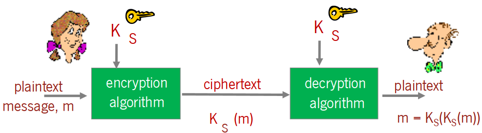
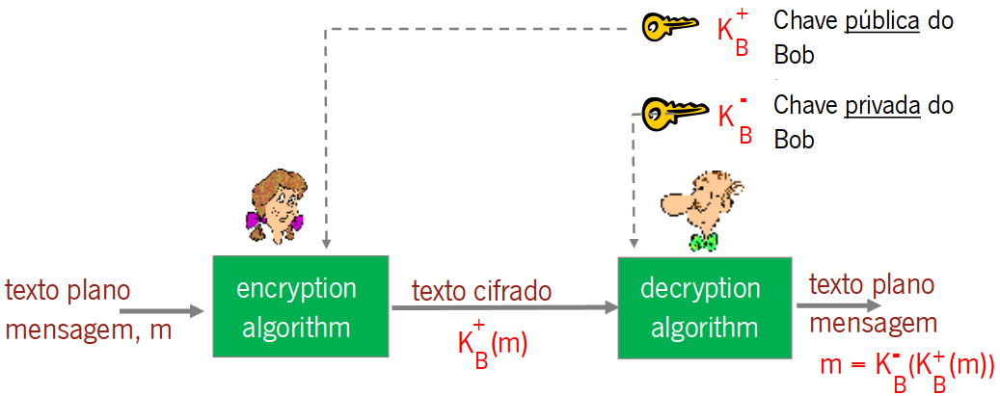

# Capitulo 4 - Segurança de Redes

## Propriedades de uma comunicação segura

 - **Confidencialidade**: só o emissor e o rector indicado devem "perceber" o conteúdo das mensagens;
 - **Autenticação**: emissor e recetor pretendem confirmar a identidade um do outro;
 - **Integridade da mensagem**: emissor e recetor querem garantir que a mensagem não foi alterada (no percurso pela rede, antes do envio ou depois da receção) sem que tal posa ser imediatamente detetado;
 - **Não repudio**: evidencias que impeçam intervenientes de negar comunicação;
 - **Acesso e Disponibilidade**: serviços devem estar acessiveis e com disponibilidade para os seus utilizadores;

## Criptografia
**Criptografia de chave simetrica**: emissor e recetor usam a *mesma* chave;

**Criptografia de chave pública**: uma chave para cifrar (publica) outra para decifrar (privada);

### Criptografia de chave simetrica
A criptografia de chave simétrica envolve o uso de uma única chave compartilhada entre remetente e destinatário para cifrar e decifrar mensagens. Ambas as partes utilizam a mesma chave para garantir a confidencialidade dos dados, exigindo um método seguro de compartilhamento dessa chave.

### Criptografia de chave publica
A criptografia de chave pública utiliza um par de chaves: uma pública, conhecida por todos, e outra privada, mantida em segredo. Mensagens cifradas com a chave pública só podem ser decifradas pela chave privada correspondente, fornecendo um método seguro para comunicação confidencial e autenticação.

### Infra-estrutura de chaves publicas (PKI)

**Problema chaves Simetricas**: Como é que duas entidades estabelecem um segredo (a chave secreta) usando apensas a rede?
 - **Solução**: Centro de distribuição de chaves que seja de confiança e atua como intermediário entre as entidades;

**Problema chaves Publicas**: Quando se obtem a chave publica da Alice ou do Bob na rede (email, web, etc.) como sabemos que são mesmo deles e não deo intruso?
 - **Solução**: Autoridade de Certificação (CA) de confiança (trusted certificantion authority);

## Assinatura Digital

A assinatura digital é um método criptográfico que atesta a autenticidade e integridade de uma mensagem ou documento eletrônico. Utilizando chaves privadas e públicas, a assinatura digital fornece uma maneira segura de verificar a identidade do remetente e garantir que o conteúdo não foi alterado durante a transmissão.

**Garantias**:
 - Só o Bob pode ter assinado m, pois só ele conhece a sua chave privada;
 - Mais ninguem poderia ter assinado m;
 - A mensagem que foi assinada foi m e não um m' qualquer;
 - Qualquer um pode verificar isso: basta pegar na chave publica de Bob e decifrar a assinatura;
 - Garante ainda o não repúdio pois Bob não podera negar ter usado a sua chave privada;

## Segurança: TLS

O TLS (Transport Layer Security) ou SSL (Secure Sockets Layer) opera no nível de transporte para fornecer segurança em aplicações TCP, como servidores HTTP, IMAP e SMTP. Ele oferece autenticação do servidor, e opcionalmente, do cliente. A autenticação do servidor é realizada através de certificados emitidos por autoridades de certificação (CA). Quanto à confidencialidade, o TLS garante cifragem dos dados da sessão, onde o cliente gera uma chave de sessão, cifra-a com a chave pública do servidor e a envia para o servidor. Ambas as partes, posse da chave de sessão, podem cifrar os dados trocados. A autenticação do cliente é opcional, pois a maioria dos clientes não possui certificados verificáveis.