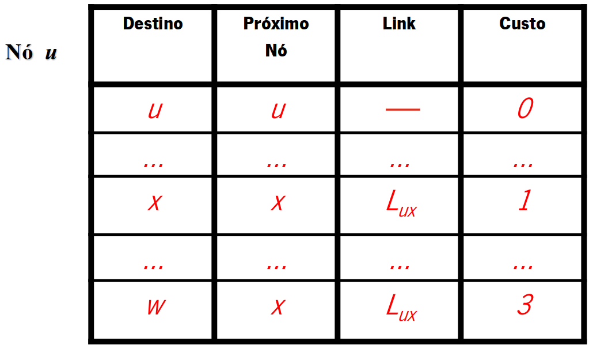
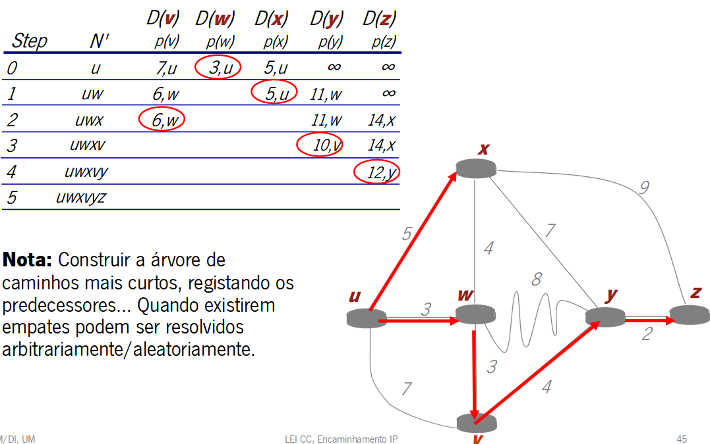
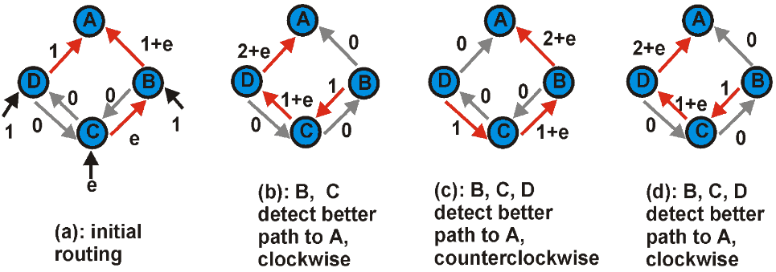

# Tabelas de Encaminhamento

**Reenvio (forwarding) num encaminhador**:
 - Utiliza a tabela de reenvio previamente preenchida pelos protocolos de encaminhamento ou pelo administrador;
 - Procura na tabela, para um dado "destino", o "proximo salto" e o "interface de saida";
 - Comuta o pacote pelo interface respetivo, encapsulando-o numa trama de acordo com o tipo de interface;

**Encaminhamento (routing)**:
 - Preenche a tabela de encaminhamento com a(s) melhor(es)  rotas para as redes de destino (classfull) ou para um conjunto de prefixos de endereços (classless);
 - Pode ser um processo manual, feito pelo administrador- encaminhamento estático;
 - Ou, no caso mais comum, um processo automatico resultante da operação de um protocolo de encaminhamento dinâminaco;

## Routers - Plano de Controlo Centralizado/Distribuido

Os roteadores podem ser classificados quanto ao plano de controle em centralizados e distribuídos. Em um plano de controle centralizado, as decisões sobre o encaminhamento de pacotes são tomadas por um único ponto central, conhecido como controlador. Este controlador coordena as informações de roteamento e toma decisões para toda a rede. Já em um plano de controle distribuído, cada roteador individual é responsável por tomar suas próprias decisões de encaminhamento com base nas informações locais disponíveis, resultando em uma abordagem mais descentralizada e adaptável à escala da rede. O modelo escolhido impacta o desempenho, a escalabilidade e a resiliência do sistema de roteamento.

## Algoritmo de Encaminhamento/Routing

Dada uma topologia de rede (um conjunto de encaminhadores com ligações de rede a interligá-los), representável como um grafo com pesos nos arcos/ligações dos seus nós, o objetivo do algoritmo de encaminhamento é determinar um “bom” caminho desde o nó fonte/origem até ao nó destino.

**A topologia de rede é um grafo em que**:
 - Os nos do grafo são os encaminhadores/routers;
 - Os arcos do grafo são as ligações/links da rede;
 - O custo das ligações pode ser estabelecido em função de varios criterios (individualmente ou em conjunto), como por exemplo, o atraso, a capacidade/ritmo nominal, do nivel de congestão, do custo operacional, da distancia, etc.;
 - Um "bom" caminho geralmente significa o caminho que minimiza ou maximiza o seu custo total;

**Tipos de Algoritmos**:
Os algoritmos de encaminhamento podem gerir a informação de duas formas distintas:
 - **Global**:
   - Todos os encaminhadores têm um conhecimento completo da topologia e custo das ligações;
   - Algoritmos de estado das ligações (*Link State-LS*);

 - **Descentralizada**:
   - Os encaminhadores só conhcem os vizinhos a que estão fisicamente/logicamente ligados e o custo das ligações respetivas;
   - O processo de computação é iterativo, havendo troca de informação entre vizinhos;
   - Algoritmos de vetor de distância (*Distance Vector-DV*);

## Algoritmo Link State (LS)

Todos os nós da topologia espalham pela rede informação sobre o estado das suas ligações de forma a construirem a base de dados topologica (usando um metodo de inundação fiavel - **Reliable Flooding**):
 - Inicialmente necessitam de coonhecer apenas os seus vizinhos diretos, para quem enviam a identificação de todos os outros seus vizinhos, bem como o custo das ligações respetivas;
 - Um nó/encaminhador ao receber esta informação atualiza a sua base de dados topológica e reenvia a informação para todos os seus vizinhos;
 - Ao fim de algum tempo todos os nós possuem um conhecimento completo da topologia e dos custos de todas as ligações.

Com esta informação, em cada nó/encaminhador, é executado um algoritmo de descoberta dos caminhos de custo mínimo, normalmente o algoritmo de *Dijkstra*.

### Escalabilidade e Oscilações
 - Esforço/Complexidade do algoritmo para N nós da rede é O(N2), portanto, a implementação dos algoritmos LS têm alguns problemas de escalabilidade;
 - Na presença de métricas assimétricas que espelham o estado da rede (por exemplo, se a métrica refletir a carga nas ligações) o cálculo da melhor rota sofre oscilações (ver exemplo abaixo em que a métrica reflete a quantidade de dados transmitidos).

## Algoritmo Distance Vector (DV)

