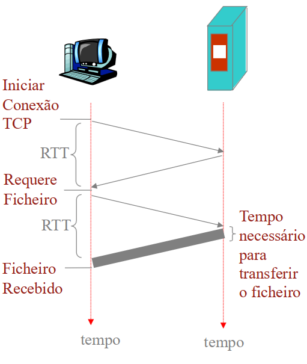

# Capitulo 2 - HTTP

## Como funciona?
HTTP é um protocolo de aplicação que roda sobre o protocolo de transporte TCP. O HTTP define a estrutura das mensagens trocadas entre o cliente e o servidor, bem como ações que devem ser tomadas por ambos os lados. O HTTP é um protocolo sem estado, ou seja, não mantém informações sobre as requisições anteriores. Cada requisição é tratada de forma independente, sem relação com as requisições anteriores. O HTTP é um protocolo orientado a transações, ou seja, cada requisição/resposta é tratada como uma transação independente.

### HTTP - Não persistente
 - Só pode ser enviado no máximo um objeto web por cada conexão TCP;
 - O HTTP 1.0 utiliza o HTTP não persistente;
 - Minimo de 2 RTT/objeto;
 - Exige mais recursos do S.O;
 - Alguns browsers abrem várias conexões TCP em paralelo para pedirem vários objetos referidos no mesmo objeto;

### HTTP - Persistente
 - Podem ser enviados múltiplos objeyos web por cada ligação estabelecida entre o cliente e o servidor;
 - O HTTP 1.1 utiliza, por defeito, o HTTP persistente;
 - Servidor mantém conexão TCP aberta;
 - Com ou sem estrtégia de pipelining;

| Sem Pipelining | Com Pipelining |
|:---:|:---:|
| O cliente envia um novo pedido apenas quando recebe a responta ao anterior | Modo por defeito no HTTP/1.1 |
| No cenario mais otimista consome-se um RTT por cada objeto | O cliente envia os pedidos assim que os encontrar no objeto referenciador |
|  | No cenario mais otimista consome-se um RTT para todos os objetos |

## Cookies

**O que permitem?**:
 - Autorizar;
 - Implementar cabaz de compras;
 - Fazer sugestões ao utilizador;
 - Manter informação da sessão por cada utilizador (ex: email);

**Como manter informação do "estado"**:
 - Entidades protcolares guardam estado por emissor/recetor entre transações distintas;
 - Cookies: forma como as mensagens HTTP transportam a informação do estado;

**Privacidade**:
 - Os cookies ensinam muito aos servidores a respeito dos utilizadores e seus hábitos;
 - O utilizador pode estar a fornecer dados ao serevidor sem saber;

## Servidores Proxy - Cache

**Porque?**:
 - Reduz o tempo de resposta para os pedidos dos clientes;
 - Reduz o trafego nos links de acesso ao exterior;
 - A internet esta povoada de caches que permitem que fornecedores de conteudos mais pobres (lentos) disponibilizem efetivamente os conteúdos;

**Como?**:
 - O servidor proxy que implementa a cache tem de atuar simultaneamente como cliente e como servidor;
 - São tipicamente instalados pelos ISP ou pelas proprias instituições;
 - O brower envia todas as HTTP request messages para o servidor proxy:
   - Se o objeto estiver na cache, o servidor proxy envia o objeto para o cliente;
   - Se o objeto não estiver na cache, o servidor proxy pede o objeto ao servidor de origem, envia o objeto ao cliente e guarda uma cópia na cache;

## Problemas de desempenho do HTTP/1.*
**Paralelismo limitado**:
 - O paralelismo está limitado ao número de conexões;
 - Na prática, mais ou menos 6 conexões por origem;

**Head-of-line blocking**:
 - Bloqueio do cabeça de fila, acumula pedidos em queue e atrasa a solicitação por parte do cliente;
 - Servidor obrigado a responder pela ordem (ordem restrita);

**Overhead protocolar é elevado**:
 - Meatdados do cabeçalho não são compactados;
 - Aproximadamente 800 bytes de metadados por pedido, mais os cookies;

## HTTP/2
**Framing Binário**:
 - *Frame* : unidade de comunicação mais pequena, contendo um cabeçalho que. no minimo, identifica a stream a que pertence;
 - *Mensagens*: sequencia completa de frames que mapeiam num pedido ou resposta;

**Stream**:
 - Streams são multiplexadas porque as frames podem ser intervaladas;
 - Todas as frames são enviadas numa única conexão TCP;
 - As frames são entregues por prioridades, tendo em conta o peso das streams e as dependencias entre elas;
 - As frames DATA estão sujeitas a um controlo de fluxo por stream e por conexão;

**Compressão do cabeçalho**:
 - Valores literais (texto) são codificados com codigo Huffmen estático;
 - Tabela de indexação estatica : valores predefinidos no protocolo;
 - Tabela de indexação dinamica : valores enviados anteriormente podem ser indexados;

## Server "push"
 - Evita o inling e permite caching eficiente de recursos;
 - Permite multiplexar e definir prioridades no envio dos recursos;
 - Precisa de controlo de fluxo para o cliente poder dizer basta/quero mais;

**Controlo de fluxo**:
 - Permite ao cliente fazer uma pausa na stream e retornar o envio mais tarde;
 - Controlo baseado num sistema de creditos (janela);
  - Cada frame do tipo DATA decrementa o valor;
  - Cada frame do tipo WINDOW_UPDATE atualiza o valor;

**Priorização**:
 - Fundamental para um rendering da pagina eficiente;
 - Cliente define as prioridades e faz logo os pedidos. Cabe ao servidor entregar os conteudos com a prioridade certa;

**Negociação protocolar (nem todos os servidores são HTTP2)**
Há três formas que o cliente tem para usar HTTP2:
 1- Começando em HTTP/1.* e pedindo "upgrade" de conexão;
 2- Usando HTTP's e negociando o protocolo HTTP2 durante o handshake TLS inicial;
 3- Sabendo que o servidor é HTTP2, envia sequência inicial em HTTP2;