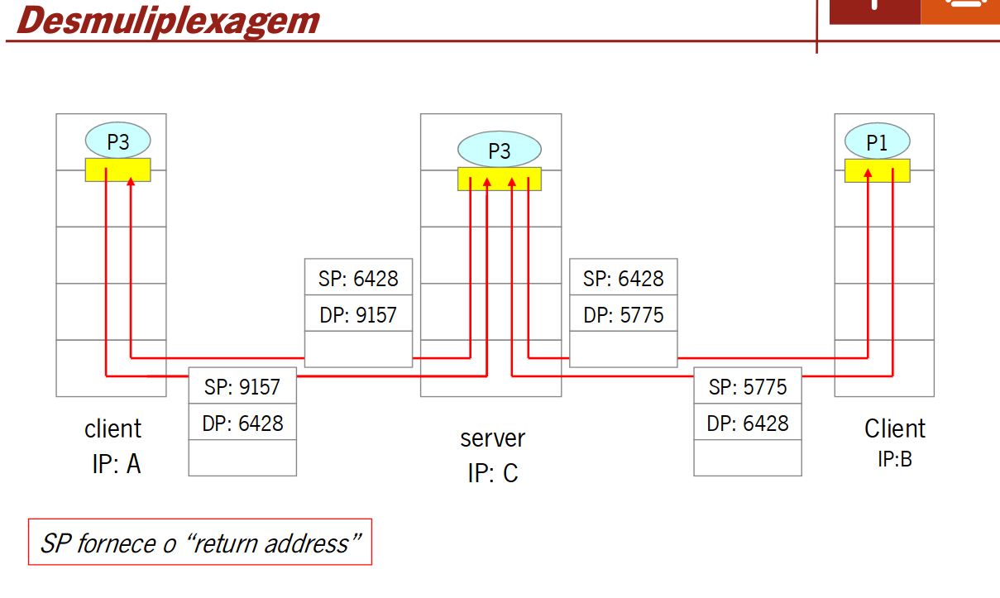

# Capitulo 1 - Nível de Transporte

Os serviços e protocolos de transporte são responsaveis por estabelecer uma conexão lógica entre aplicações executadas em sistemas terminais diferentes. Esses protocolos são executados nos sistemas terminais, onde o emissor divide a mensagem gerada pela aplicação em segmentos, que são transmitidos á camada de rede. No lado do receptor, os diferentes segmentos são reunidos para formar a mensagem original, que é então entregue à aplicação correspondente. Na Internet, dois dos principais protocolos de transporte são o TCP (Transmission Control Protocol) e o UDP (User Datagram Protocol). O TCP oferece uma comunicação confiável e orientada à conexão, enquanto o UDP proporciona uma comunicação mais rápida, porém menos confiável e sem a necessidade de estabelecer uma conexão prévia.

## Multiplexação e Demultiplexação

 - Desmultiplexagem é efetuada pelo sistema terminal destino ao receber um datagrama IP.
 - Cada datagrama contem um segemento TCP ou UDP.
 - Cada segmento possui a identificação da porta de origem e da porta destino.
 - O sistema terminal usa os endereços IP e os numeros de porta para encaminhar o segmento para o socket correto.

## Protocolo UDP - User Datagram Protocol

Funções do UDP:
 - Protocolo de transporte fim-a-fim não confiável;
 - Orientado ao datagrama;
 - Atua como uma interface da aplicação com o IP para multiplexar e desmultiplexar tráfego;
 - Usa o conceito de porta/número de porta
 - Utilizado em situações que não justificam o TCP, ou quando as aplicações querem controlar o fluxo de dados e gerir erros de transmissão diretamente.
 
