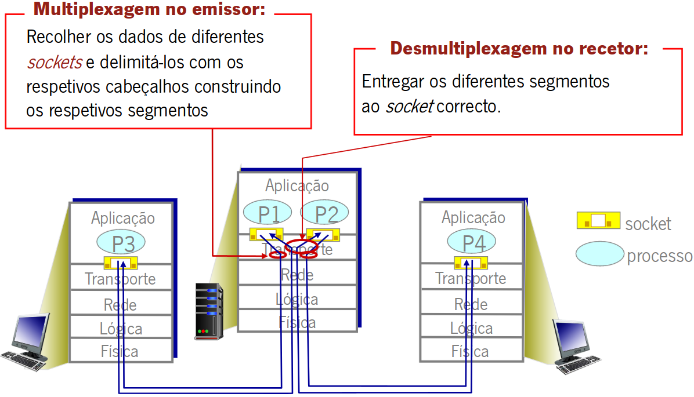
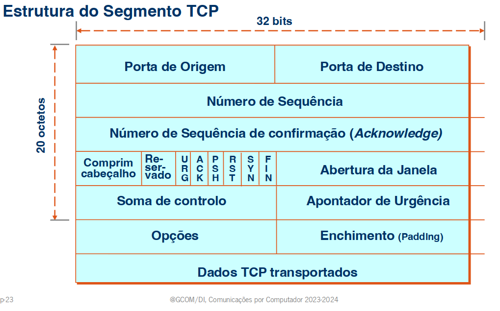

# Capitulo 1 - Nível de Transporte

Os serviços e protocolos de transporte são responsaveis por estabelecer uma conexão lógica entre aplicações executadas em sistemas terminais diferentes. Esses protocolos são executados nos sistemas terminais, onde o emissor divide a mensagem gerada pela aplicação em segmentos, que são transmitidos á camada de rede. No lado do receptor, os diferentes segmentos são reunidos para formar a mensagem original, que é então entregue à aplicação correspondente. Na Internet, dois dos principais protocolos de transporte são o TCP (Transmission Control Protocol) e o UDP (User Datagram Protocol). O TCP oferece uma comunicação confiável e orientada à conexão, enquanto o UDP proporciona uma comunicação mais rápida, porém menos confiável e sem a necessidade de estabelecer uma conexão prévia.

## Multiplexação e Demultiplexação

 - Desmultiplexagem é efetuada pelo sistema terminal destino ao receber um datagrama IP.
 - Cada datagrama contem um segemento TCP ou UDP.
 - Cada segmento possui a identificação da porta de origem e da porta destino.
 - O sistema terminal usa os endereços IP e os numeros de porta para encaminhar o segmento para o socket correto.

## Protocolo UDP - User Datagram Protocol

Funções do UDP:
 - Protocolo de transporte fim-a-fim não confiável;
 - Orientado ao datagrama;
 - Atua como uma interface da aplicação com o IP para multiplexar e desmultiplexar tráfego;
 - Usa o conceito de porta/número de porta;
 - Utilizado em situações que não justificam o TCP, ou quando as aplicações querem controlar o fluxo de dados e gerir erros de transmissão diretamente;

Uma aplicação pode escolher o UDO devido a vários motivos:

 - **Maior controle sobre o envio dos dados:** A aplicação tem autonomia para decidir quando e como enviar ou reenviar dados, sem depender do protocolo de transporte.

 - **Fuga ao controle de congestão do TCP:** UDP não está sujeito às regras rigorosas de controle de congestão do TCP, permitindo à aplicação determinar a taxa de envio de dados.

 - **Controle sobre o tamanho dos dados enviados:** A aplicação decide a quantidade de bytes a enviar em cada transmissão.

 - **Ausência de estabelecimento e terminação de conexão:** Não é necessário criar ou encerrar uma conexão antes da transmissão de dados, acelerando a comunicação.

 - **Ausência de manutenção de informação de estado por conexão:** Não é preciso manter informações de estado por conexão, simplificando o processo.

 - **Menor overhead por pacote:** O cabeçalho UDP é mais leve, com apenas 8 bytes, reduzindo a sobrecarga em comparação com o TCP.

Aplicações escolhem o UDP devido ao maior controle sobre o envio de dados, permitindo à aplicação decidir quando e como enviar ou reenviar dados sem depender do transporte. A fuga ao controle de congestão do TCP e a capacidade de determinar a quantidade de bytes enviados por vez são vantagens. Além disso, a ausência de estabelecimento e terminação de conexão, juntamente com a falta de necessidade de manter informações de estado, resultam em menor overhead por pacote, dado o cabeçalho UDP ser apenas 8 bytes.

## Protocolo TCP - Transmission Control Protocol

Funções do TCP:
 - Protocolo de transporte fim-a-fim confiável;
 - Orientado à conexão;
 - Cada conexão é identificada por um par de sockets;
 - Uma conexao é um circuito virtual entre portas de aplicações;
 - Multiplexa os dados de várias aplicações através de numero de porta;
 - Efetua controlo de erros, controlo de fluxo e controlo de congestão;

 - <u>Porta Orig/Dest</u> - Nª da porta TCP da aplicação de Origem/Destino;
 - <u>Numero de Sequência</u> - Ordem do primeiro octeto de dados no segmento (se SYN=1, este número é o initial sequence number, ISN);
 - <u>Numero de Ack(32 bits)</u> - O numero de ordem do octeto seguinte na sequência que a entidade TCP espera receber;
 - <u>Comprimento Cabeçalho(4 bits)</u> - Numero de palavras de 32 bits de cabeçãlho;
 - <u>Flags(6 bits)</u> - Indicações especificas;
 - <u>Janela</u> - Numero de octetos que o receptor é capaz de receber (controlo de fluxo);
 - <u>Soma de controlo (16bits)</u> - Soma para a deteção de erros (segm);
 - <u>Apontador urgente</u> - Adicionado ao numero de sequencia da o nº de sequencia do ultimo otecto de dados urgentes;
 - <u>Opções</u> - Especifica caracteristicas opcionais (ex: MSS, timestamp, factor de escala para a janela, etc.);

